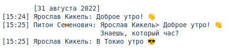

# vk-messages-saver

[](https://github.com/YariKartoshe4ka/vk-messages-saver/commits/master)
[](https://github.com/YariKartoshe4ka/vk-messages-saver/releases)
[](https://dev.vk.com/)
[](https://pypi.org/project/vkms/)
[](https://github.com/YariKartoshe4ka/vk-messages-saver/actions)

Утилита для сохранения переписок ВКонтакте


### Установка

Загружаем и устанавливаем последнюю версию VKMS из [PyPI](https://pypi.org/project/vkms/)

```bash
pip install vkms
```


### Использование

1. Получаем токен доступа с правами на сообщения от официального приложения. Можно воспользоваться [этим сайтом](https://vkhost.github.io/). После авторизации копируем из адресной строки параметр *access_token* и вставляем его в терминал

    ```bash
    export ACCESS_TOKEN='...'
    ```

2. Запускаем VKMS и скачиваем полную информацию о переписках

    ```bash
    vkms dump
    ```

    Теперь можно спарсить полученные данные в удобный для чтения формат

    ```bash
    vkms parse
    ```


### Функции

В данный момент VKMS может:

- Сохранять переписки в программном формате (JSON), доступна многопоточная загрузка (`vkms dump`)
- Сохранять переписки в удобном для чтения формате (`vkms parse`)
    - TXT, за основу была взята структура формата [hikiko4ern'а](https://github.com/hikiko4ern/vk_dump)
    - HTML, кастомная верстка, максимально приближенная к официальному приложению VK Android

<table>
    <tr align="center">
        <th>HTML</th>
        <th>TXT</th>
    </tr>
    <tr>
        <td width="50%"></td>
        <td width="50%"></td>
    </tr>
</table>

- Загружать вложения, доступна многопоточная загрузка (`vkms atch`)
    - Фото
    - Документы
    - Стикеры
    - Подарки
    - Голосовые сообщения
    - Граффити

[Подробное описание](https://github.com/YariKartoshe4ka/vk-messages-saver/blob/master/docs/DOCS.md)
