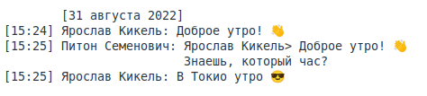
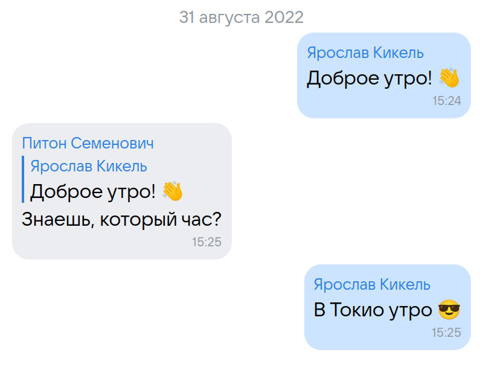

## Оглавление

0. [Общая информация](#0-общая-информация)
    1. [Применение и направленность](#01-применение-и-направленность)
    2. [Структура полчаемых файлов](#02-структура-получаемых-файлов)
    3. [Общие опции для всех подкоманд](#03-общие-опции-для-всех-подкоманд)
1. [Сохранение переписки в программном формате (`vkms dump`)](#1-сохранение-переписки-в-программном-формате)
    1. [Опции подкоманды `dump`](#11-опции-подкоманды-dump)
    2. [Общий принцип хранения информации](#12-общий-принцип-хранения-информации)
    3. [Формат JSON](#13-формат-json)
    4. [Формат SQLite](#14-формат-sqlite)
2. [Парсинг полученной информации в удобный для чтения формат (`vkms parse`)](#2-парсинг-полученной-информации-в-удобный-для-чтения-формат)
    1. [Опции подкоманды `parse`](#21-опции-подкоманды-parse)
    2. [Формат TXT](#22-формат-txt)
    3. [Формат HTML](#23-формат-html)
3. [Загрузка вложений переписки (`vkms atch`)](#3-загрузка-вложений-переписки)
    1. [Опции подкоманды `atch`](#31-опции-подкоманды-atch)
    2. [Поддерживаемые типы вложений](#32-поддерживаемые-типы-вложений)


## 0. Общая информация

#### 0.1. Применение и направленность

Основной целью утилиты VKMS (*VK Messages Saver*) является сохранение текста и вложений переписок ВКонтакте.
Главные векторы, учитавающиеся при разработке:

1. Минимизация обращений к VK API и абстрагирование от него других подкоманд, **~~ведь пользователь в любой момент может сменить пароль~~**
2. Высокая скорость и возможность обработки даже самых длинных переписок (*более 2 млн. сообщений*)
3. Независимость от самой утилиты, `vkms dump` позволяет сохранить переписки **как есть** (*почти* сырые JSON результаты обращений к VK API)

#### 0.2. Структура получаемых файлов

После работы программы в текущей дериктории появится новая папка. Абстрактная схема содержимого:

```sh
vkms-result                           # Корневая папка
├── attachments                        # Папка со всеми вложениями
│   ├── audio_messages                  # Папка с вложениями типа `audio_message`
│   │   ├── ...
│   │   └── 123456789_987654321.mp3
│   ├── photos                          # Папка с вложениями типа `photo`
│   │   ├── ...
│   │   └── 123456789_987654321.jpg
│   └── stickers                        # Папка с вложениями типа `sticker`
│       ├── ...
│       └── 1234_4321.png
├── dialogs                            # Папка со всеми переписками
│   ├── html                            # Папка с переписками формата HTML
│   │   ├── ...
│   │   └── Питон Семенович_558891166.html
│   └── txt                             # Папка с переписками формата TXT
│       ├── ...
│       └── Питон Семенович_558891166.txt
├── .json                              # Папка с переписками в программном формате JSON
│   ├── ...
│   └── 558891166.json
├── .sqlite                            # Папка с переписками в программном формате SQLite (+JSON)
│   ├── ...
│   └── 558891166.sqlite
└── logs.txt                           # Логи
```

Разумеется разные файлы и подпапки появляются в результате работы разных подкоманд


#### 0.3. Общие опции для всех подкоманд

- `-o/--out OUTDIR`

    Путь к папке, в которой будет сохранен результат выполнения программы.
    По умолчанию все будет сохранено в папке *vkms-result* в текущей директории.
    [Подробнее](#02-структура-получаемых-файлов)

- `-i/--include INCLUDE`

    Разделенный запятыми список идентификаторов переписок, которые должны быть сохранены.
    **Только перечисленные** переписки будут сохранены. Для идентификаторов бесед доступен
    короткий вид записи (*2000000015 = c15*)

- `-e/--exclude EXCLUDE`

    Разделенный запятыми список идентификаторов переписок, которые **не** должны быть сохранены.
    Не совместим с флагом `-i`. При отсутствии флага `-i` или `-e` будут сохранены все переписки.
    Для идентификаторов бесед доступен короткий вид записи (*2000000015 = c15*)

- `-v`

    Уровень логгирования программы. Все сообщения будут сохранены в файле *logs.txt* <br>
    Уровни логгирования:

    |                            | -       | -v      | -vv     | -vvv    |
    |:--------------------------:|:-------:|:-------:|:-------:|:-------:|
    | **vkms**                   | WARNING | INFO    | DEBUG   | DEBUG   |
    | **импортированные модули** | WARNING | WARNING | WARNING | DEBUG   |


## 1. Сохранение переписки в программном формате

#### 1.1. Опции подкоманды `dump`

- `--token TOKEN`

    Ключ доступа к VK API с правами *messages* от официального приложения. Может быть получен с
    помощью [этого сайта](https://vkhost.github.io/). Для более удобного оперирования опциями
    длинный токен может быть передан в качестве переменной окружения (`export ACCESS_TOKEN='...'`),
    в таком случае параметр `--token` не обязателен

- `--max MAX`

    Максимальное количество последних сообщений, которое будет сохранено (по умолчанию *100000*).
    Чтобы скачать переписку полностью, следует передать не число, а *"all"*. При указаном параметре
    `-a/--append` данная опция будет отвечать не за *N* последних сообщений, а за *N* сообщений,
    **следующих за ранее скачанными**

- `-a/--append`

    При указанном флаге сообщения будут дозаписаны к текущей переписке, иначе переписка будет скачана
    занаво

- `-t/--threads THREADS`

    Количество потоков для загрузки переписок (по умолчанию *2*). Увеличение этого параметра может
    спровоцировать ошибку VK API 6 (*"Too many requests per second."*) или заморозку аккаунта за
    *"Подозрительную активность"*

- `--export-json`

    Дополнительно экспортировать данные о переписках в формате JSON


#### 1.2. Общий принцип хранения информации

Как говорилось [ранее](#01-применение-и-направленность), VKMS сохраняет сырые JSON результаты обращений
к VK API для возможности последующей обработки вне VKMS. В ранних версиях (<1.0.0) основных форматом
переписок был JSON: все результаты обращений к API собирались в одно целое и напрямую записывались в
файл. Данный подход имел ряд недостатков, и главным из них было повышенное использование ОЗУ, поэтому
максимально возможное для сохранения количество сообщений напрямую зависило от объема памяти. На смену
пришёл SQLite всего с одной (ну или почти) табличкой "messages", где каждая запись - объект сообщения
в чистом формате JSON, но для более простой обработки данных вне VKMS формат JSON всё-таки был сохранен,
хотя и в немного в изменном виде:

#### 1.3. Формат JSON

Файл делится на три секции специальными разделителями:

1. `------ PEER ------`

    В этой секции содержится общая информация о переписке: на первой строке - JSON
    объект владельца переписки, а на второй - JSON объект самой переписки

2. `------ MESSAGES ------`

    В этой секции содержатся все сообщения переписки, каждый объект сообщения
    находится на новой строке

3. `------ USERS ------`

    В этой секции содержатся все участники переписки, каждый объект пользователя (или
    группы) находится на новой строке


```js
------ PEER ------
{"id": 558891166, "first_name": "Питон", "last_name": "Семенович", ... }    // API.users.get (владелец переписки)
{"peer": {"id": ..., "type": "chat", "local_id": ...}, ... }                // API.messages.getConversations (базовая информация о переписке)
------ MESSAGES ------                                                      // API.messages.getHistory (все сообщения переписки)
{"date": 1650379421, "from_id": 558891166, "id": 1, "out": 0, ... }
{"date": 1650379429, "from_id": 558891166, "id": 2, "out": 0, ... }
...
{"date": 1650379437, "from_id": ..., "id": ..., "out": 0, ... }
------ USERS ------                                                         // API.users.get + API.groups.getById (все участники переписки, включая группы)
{"id": 558891166, "first_name": "Питон", "last_name": "Семенович", ... }
{"id": 1, "first_name": "Alice", "last_name": "...", ... }
...
{"id": 999999999, "first_name": "Bob", "last_name": "...", ... }
```

#### 1.4. Формат SQLite

Имеет очень схожую структуру с предыдущим форматом, но в качестве разделителей на секции выступают таблицы

```sql
CREATE TABLE peer (
    id INTEGER NOT NULL,
    account JSON NOT NULL,    -- API.users.get (владелец переписки)
    info JSON NOT NULL,       -- API.messages.getConversations (базовая информация о переписке)
    PRIMARY KEY (id)
);
CREATE TABLE messages (       -- API.messages.getHistory (все сообщения переписки)
    id INTEGER NOT NULL,
    json JSON NOT NULL,
    date DATETIME NOT NULL,
    PRIMARY KEY (id)
);
CREATE TABLE users (          -- API.users.get + API.groups.getById (все участники переписки, включая группы)
    id INTEGER NOT NULL,
    json JSON NOT NULL,
    PRIMARY KEY (id)
);
```


## 2. Парсинг полученной информации в удобный для чтения формат

#### 2.1. Опции подкоманды `parse`

- `-f FORMAT`

    Удобный для чтения формат в котором будут сохранены сообщения. Доступные форматы: *txt*, *html*

#### 2.2. Формат TXT

Самый первый реализованный формат. Структура была заимствована у **deprecated** сохранялки [vk_dump](
https://github.com/hikiko4ern/vk_dump).



###### Плюсы:

- Парсер реализован как **memory-efficient**: в ходе работы обрабатывает сообщения по очереди и сразу
записывает их в файл, что даёт возможность работать с переписками любых размеров (даже очень-очень длинными)
- Гарантируется, что данный формат будет первым получать и поддерживать все нововведения VK (раньше это были
исчезающие сообщения, уведомление об изменении темы и др.)
- Прочитать переписку данного формата можно в любом редакторе или даже в консоли, ведь это обычный текстовый
файл (т.е. не зависит от ПО)

###### Минусы:

- Не всегда удобно ориентироваться в файле
- Нельзя по ходу смотреть медиавложения

#### 2.3. Формат HTML

Красивый и интуитивно понятный формат, сверстан мною с клиента VK на Android



###### Плюсы:

- Красивый формат, приятен для глаз. Есть темная тема, на которую можно переключиться, нажав клавишу "**t**"
- По ходу чтения переписки можно сразу смотреть медиавложения, для прослушивания голосовых сообщений
реализован удобный плеер

###### Минусы:

- Потребляет много ОЗУ, т.к. парсер загружает **всю** переписку в память
- Скорее всего, вы не сможете открыть большие переписки (зависит от железа и браузера)
- Не гарантируется, что данный формат будет поддерживать все нововведения VK
- Переписки в HTML формате занимают места в несоклько раз больше чем переписки в TXT


## 3. Загрузка вложений переписки

#### 3.1. Опции подкоманды `atch`

- `-t/--threads THREADS`

    Количество потоков для загрузки вложений (по умолчанию 8). Может быть увеличен/уменьшен в зависимости
    от пропускной способности вашей сети

- `--ts TYPES`

    Разделенный запятыми список типов вложений, которые будут загружены. Доступные варианты:
    *photos*, *docs*, *stickers*, *gifts*, *audios*, *graffiti*

#### 3.2. Поддерживаемые типы вложений

Как вы могли заметить ранее, VKMS поддерживает загрузку только определенных медиавложений. Связано
это с тем, что информация об этих вложениях передается прямо в объекте переписки и для них не
нужно выполнять отдельные запросы, такие как `video.get` (для видеовложений).

###### Поддерживаемые вложения:

- Фото
- Документы
- Стикеры
- Подарки
- Голосовые сообщения
- Граффити
